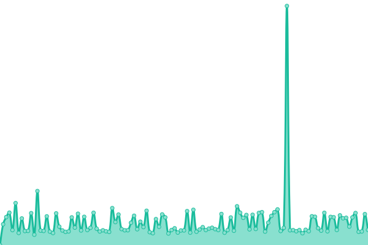
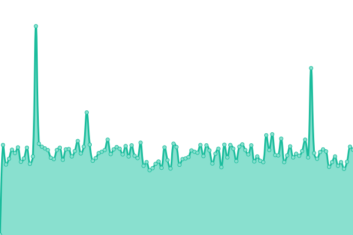
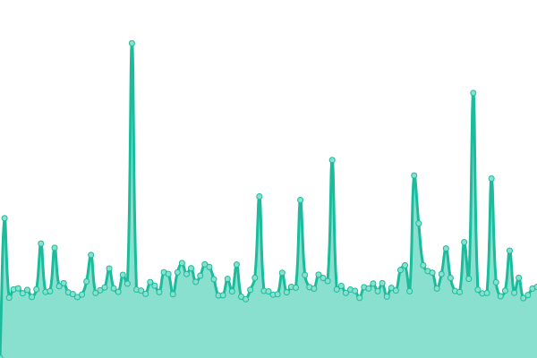

# [📈 Live Status](https://status.sonic.wiki): <!--live status--> **🟩 All systems operational**

This repository contains the open-source uptime monitor and status page for [Upptime](https://upptime.js.org), powered by [Upptime](https://github.com/upptime/upptime).

With [Upptime](https://upptime.js.org), you can get your own unlimited and free uptime monitor and status page, powered entirely by a GitHub repository. We use [Issues](https://github.com/upptime/upptime/issues) as incident reports, [Actions](https://github.com/sonicspinforum/SonicpediaStatus/actions) as uptime monitors, and [Pages](https://status.sonic.wiki) for the status page.

<!--start: status pages-->
<!-- This summary is generated by Upptime (https://github.com/upptime/upptime) -->
<!-- Do not edit this manually, your changes will be overwritten -->
<!-- prettier-ignore -->
| URL | Status | History | Response Time | Uptime |
| --- | ------ | ------- | ------------- | ------ |
|  [索尼克百科 Sonicpedia](https://sonic.wiki/) | 🟩 Up | [sonicpedia.yml](https://github.com/sonicspinforum/SonicpediaStatus/commits/HEAD/history/sonicpedia.yml) | 

 1091ms
     
 | 

<a href="https://status.sonic.wiki/history/sonicpedia">100.00%</a>
    

|  [索尼克百科 Action API](https://sonic.wiki/api.php?action=query&prop=info&titles=Sonic) | 🟩 Up | [action-api.yml](https://github.com/sonicspinforum/SonicpediaStatus/commits/HEAD/history/action-api.yml) | 

 754ms
     
 | 

<a href="https://status.sonic.wiki/history/action-api">100.00%</a>
    

|  [索尼克百科 REST API](https://sonic.wiki/rest.php/v1/page/Sonic) | 🟩 Up | [rest-api.yml](https://github.com/sonicspinforum/SonicpediaStatus/commits/HEAD/history/rest-api.yml) | 

 216ms
     
 | 

<a href="https://status.sonic.wiki/history/rest-api">100.00%</a>
    

|  [索尼克百科 Parsoid](https://sonic.wiki/api.php?action=visualeditor&format=json&paction=parse&page=Sonic) | 🟩 Up | [parsoid.yml](https://github.com/sonicspinforum/SonicpediaStatus/commits/HEAD/history/parsoid.yml) | 

 821ms
     
 | 

<a href="https://status.sonic.wiki/history/parsoid">100.00%</a>
    

<!--end: status pages-->

[**Visit our status website →**](https://status.sonic.wiki)

## 📄 License

- Powered by: [Upptime](https://github.com/upptime/upptime)
- Code: [MIT](./LICENSE) © [Upptime](https://upptime.js.org)
- Data in the `./history` directory: [Open Database License](https://opendatacommons.org/licenses/odbl/1-0/)
